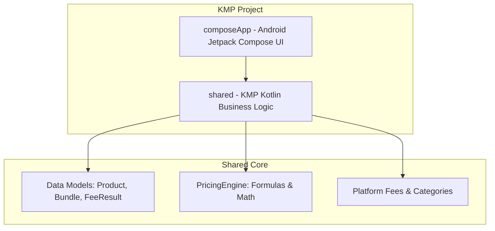

# Android KMP Dashboard App Spec

This document details the design and specification for porting the Calcucom Marketplace Profit & Commission fee dashboard to a Kotlin Multiplatform (KMP) Android application.

## Overview

The Calcucom web application is a high-fidelity commission fee and profit calculator for Indonesian marketplaces (Shopee, Tokopedia, TikTok Shop, Lazada). It features advanced tools such as:
1. **Profit Calculator**: Calculates fees, margins, and profit per product based on categories and programs.
2. **Price Finder**: Suggests selling prices for target margins.
3. **ROAS Calculator**: Analyzes break-even ROAS and advertising budgets.
4. **Scenarios & Compare**: Compares Scenario A and Scenario B.
5. **Ads Analyzer**: Evaluates ad profitability.
6. **Bundling Calculator**: Simulates multi-product bundles and allocates fees.
7. **Recipe HPP Calculator**: Computes ingredient costs for recipe HPP.

The Android version will be built using **Kotlin Multiplatform (KMP)** and **Jetpack Compose** (Material 3).

## Proposed Architecture

We will implement a multi-module KMP structure:
1. **`shared` module (Kotlin Multiplatform)**: Contains the pure Kotlin business logic (`PricingEngine`, constants, models, formulas). This logic is platform-agnostic and ready to be shared with iOS, desktop, or web in the future.
2. **`composeApp` module (Android App with Compose)**: Contains the Android application setup, navigation, and Jetpack Compose screens.

## Proposed Components

### 1. Shared Core (`:shared`)
- **`com.calcucom.shared.model`**:
  - `Product`: Data class for HPP, price, quantity, discount.
  - `FeeResult`: Detailed breakdown of admin fees, service fees, cashback fees, process fees, and net profit/margin.
  - `BundleResult`: Structure for bundle calculations, fee allocations, and insights.
  - `RoasResult`: Performance and ad metrics.
- **`com.calcucom.shared.engine.PricingEngine`**:
  - Pure Kotlin object reproducing the JavaScript `PricingEngine` math exactly.
  - Methods: `calculateSingleProduct`, `calculateMarketplaceFees`, `calculateOptimalPrice`, `calculateBundle`, `calculateROAS`, `analyzeAdPerformance`.
- **`com.calcucom.shared.constants.AppConstants`**:
  - Fee rates for Shopee, Tokopedia, TikTok Shop, and Lazada.
  - Categories lists and groups mapping (A-F, groups).

### 2. UI Screens (`:composeApp`)
- **MainDashboardScreen**: Scaffold with a TabRow / NavigationBar to switch between tabs (Material 3).
- **Tab 1: Profit Calculator**: Input fields for price, HPP, discount, platform, seller type, categories, and service toggles. Live results with visual health indicator badges.
- **Tab 2: Price Finder**: Target margin/profit finder.
- **Tab 3: Bundling**: Dynamic list of items, bundle price, fee allocation breakdown, and business insights dashboard (with color-coded warnings).
- **Tab 4: Ads & ROAS**: Ad performance analyzer and ROAS calculators.
- **Tab 5: Recipe HPP**: Dynamic list of ingredients, cost, quantity, and waste calculation.

## Approaches & Trade-offs

### Approach A: Compose Multiplatform (CMP) UI [Recommended]
- **Pros**: UI is written in the shared module (`shared/src/commonMain/compose`) allowing it to be compiled to iOS and desktop with zero UI changes.
- **Cons**: Requires more CMP boilerplate and library dependency setup in `shared`.
- **Decision**: Since we are focusing on the Android app but want KMP extensibility, we will use a KMP structure where `:shared` contains the pure Kotlin logic, and `:composeApp` is the Compose application container for Android. This provides a robust, standard setup that is easy to build and test.

## Verification Plan

### Automated Tests
- Kotlin unit tests in `:shared` to verify that calculations (`PricingEngine`) match JavaScript expectations exactly.
- Gradle build command `./gradlew assembleDebug` to verify successful compilation.

### Manual Verification
- Deploying the app to a running emulator (e.g., Pixel) and navigating through tabs.
- Capturing screenshots of the UI.
